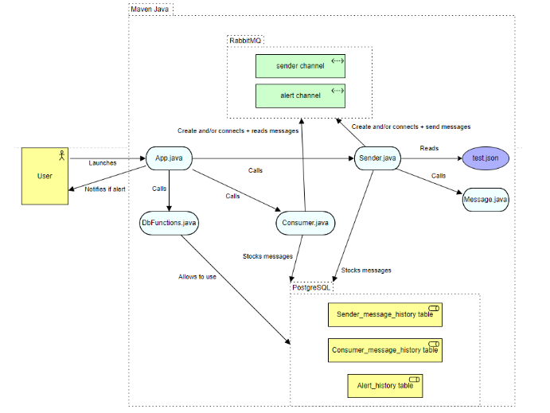
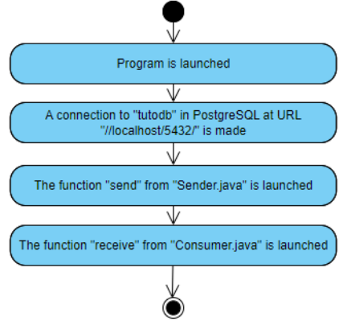
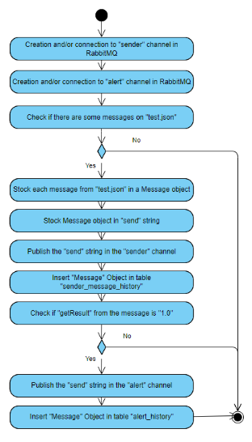
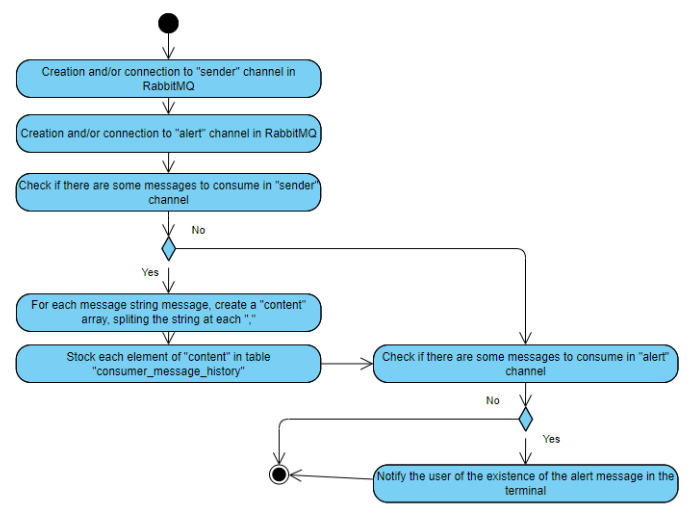
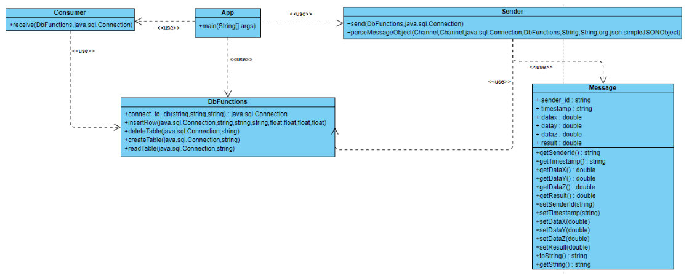
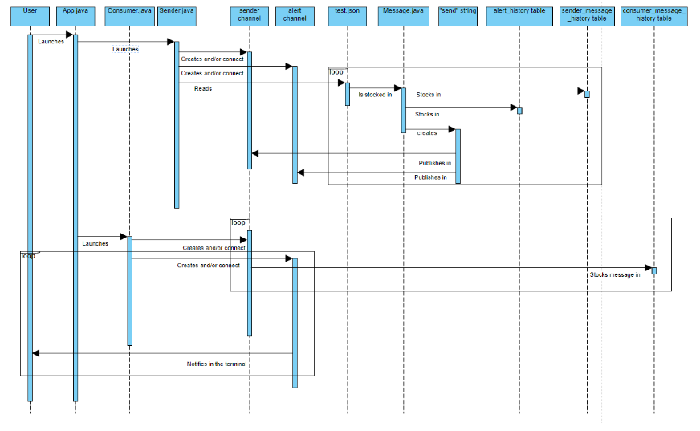

## Project Description

The goal of the integration project is to link the Fall Detection app project and the Smart Hopistal project to be able to alert Smart Hospital of a patient fall, and give them access to a history of all activity of the fall detection application.

This application was projected as Maven program and use pgAdmin 4, Google JSON Simple, and Rabbit MQ. This application read a JSON file sent by the Fall Detection app, and update the database with fall detection monitoring data. 

This way, using three tables, and two channels, we are able to follow the flow of alert and messages sent and received. Also, the user is notified in the terminal if an alert is detected.

## Setup Requirements

Here are listed the applications I used, with the external libraries to add thanks to Maven in IntelliJ.

| Application | Link to download |
| ------ | ------ |
| JetBrains IntelliJ IDEA | [https://www.jetbrains.com/idea/download/#section=windows] |
| PostgreSQL 15 | [https://www.postgresql.org/download/] |
| Rabbit MQ | [https://mvnrepository.com/artifact/com.rabbitmq/amqp-client/5.16.0] |

| External libraries | .jar extension | 
| ------ | ------ |
| Google JSON Simple | json-simple-1.1.1.jar |
| PostgreSQL | postgresql-42.5.3.jar |
| Rabbit MQ | ampq-client-5.16.0.jar |

**Since everything is done locally, all external libraries will need a specific localhost address**

## Application Architecture

## Activity Diagrams

Activity Diagram for “App.java”:

Activity Diagram for “Sender.java”:

Activity Diagram for “Consumer.java”:

## Class Diagram

## Sequence Diagram

## Data Structure

The database is made of 3 tables : 

- sender_message_history
- consumer_message_history
- alert_history

All 3 tables have 7 columns : 

- mesid : automatically generated integer, primary key
- senderid : character varying of max. size 200
- timestamp : character varying of max. size 200
- datax : double 
- datay : double 
- dataz : double 
- result : double 

## Classes description

Our program is made of 5 java files :
- [App.java][App]
- [Sender.java][Sender]
- [Consumer.java][Consumer]
- [Message.java][Message]
- [DbFunctions.java][DbFunctions]

To test our program, we have the [test.json][test] file.

# Going Further

In order to go further, here are some ideas to develop : 

- Find a common way to work between Smart Hospital devs and integration devs (share database and channels ?)
- Draws the lines of the project : better definition of what is expected from the integration project
- Use of containerization to export the project
- Get access to Smart Hospital and Fall Detection projects, to improve the efficiency of the program

[App]: <my-app/src/main/java/com/mycompany/app/App.java>
[Sender]: <my-app/src/main/java/com/mycompany/app/Sender.java>
[Consumer]: <my-app/src/main/java/com/mycompany/app/Consumer.java>
[Message]: <my-app/src/main/java/com/mycompany/app/Message.java>
[DbFunctions]: <my-app/src/main/java/com/mycompany/app/DbFunctions.java>
[test]: <my-app/src/main/java/com/mycompany/app/test.json>
